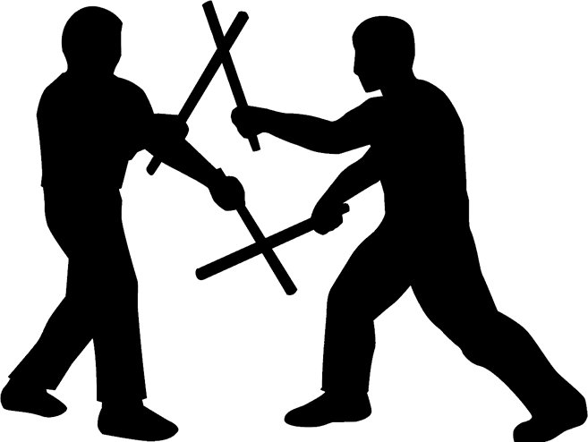

# STIX_Capstone

## Project name: 
STIX FMA Fun Finder

## Description: 
The STIX project has been built as my capstone project for the June 2020 Savvy Coders full-stack bootcamp. 
This application offers a very simple application to help enthusiasts find the closest **Filipino Martial arts clubs or events** in their area.

## Table of Contents: 
This README contains the following information
- Installation 
- Usage 
- Contributions
- Credits
- Licensing

## Installation: 
Installation instructions will be added as they become clearer, but the application will initially be available as a website, and eventually as a mobile app.

## Usage: 
This App should be pretty simple to use, Once installed the UI has an input field for a zip code, and 3 option buttons – one for school, one for event, and one for all. By default he all option is selected.
Toward the bottom of the display, a simple text button offers the options to "Add a School / Event".

Clicking the "Add a School / Event" button opens a form interface that requests info about the submitter and the addition to be made. 

In the application-wide footer there are 3 buttons - "About", "Home", "Contact".
Clicking on the "About" button takes the user to the about us page with basic info on the application.
Clicking the "Contact" button opensa a contact us form interface that allows the users to write to the application owner.

Searching (submitting) without a zip will ask for one to continue - a zip code is required.
The option buttons below the search bar are optional. Searching without an option selected will return all schools and events that match the zip code search parameters.

When search results are returned, first results returned will fall into a default 50-mile radius. Filtering options and a search button will be presented to narrow the search. Filter drop-down options will include fields for… Zip, State, Radius, Type (which would be school, event, or all), and style (which could be Arnis, Escrima, kali, or All). Choosing new options and clicking the search button agian will return the new seerch results.

## Contributing: 
Instructions on how to contribute to this project will be shared as they become available.

## Credits: 
Credits will be included as credit is due to those awesome peeps that have given of themselves to this project.

## License: 

### MIT License
Copyright (c) 2020 Johan B. Bester

Permission is hereby granted, free of charge, to any person obtaining a copy of this software and associated documentation files (the "Software"), to deal in the Software without restriction, including without limitation the rights to use, copy, modify, merge, publish, distribute, sublicense, and/or sell copies of the Software, and to permit persons to whom the Software is furnished to do so, subject to the following conditions:

The above copyright notice and this permission notice shall be included in all copies or substantial portions of the Software.

THE SOFTWARE IS PROVIDED "AS IS", WITHOUT WARRANTY OF ANY KIND, EXPRESS OR IMPLIED, INCLUDING BUT NOT LIMITED TO THE WARRANTIES OF MERCHANTABILITY, FITNESS FOR A PARTICULAR PURPOSE AND NONINFRINGEMENT. IN NO EVENT SHALL THE AUTHORS OR COPYRIGHT HOLDERS BE LIABLE FOR ANY CLAIM, DAMAGES OR OTHER LIABILITY, WHETHER IN AN ACTION OF CONTRACT, TORT OR OTHERWISE, ARISING FROM, OUT OF OR IN CONNECTION WITH THE SOFTWARE OR THE USE OR OTHER DEALINGS IN THE SOFTWARE.

